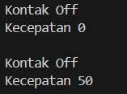
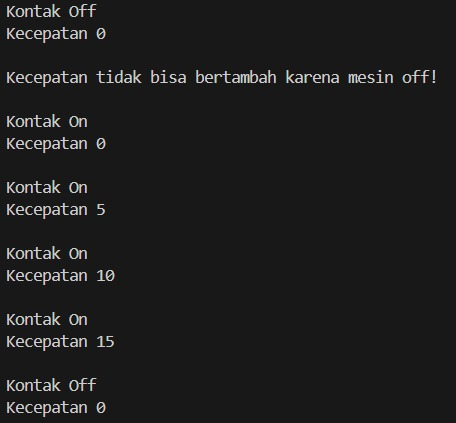
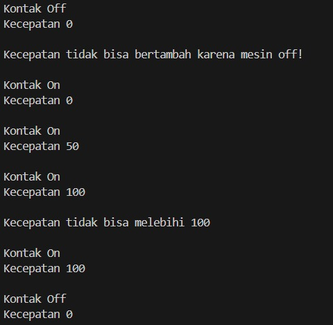
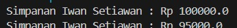
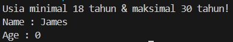
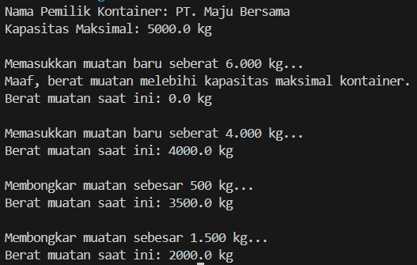
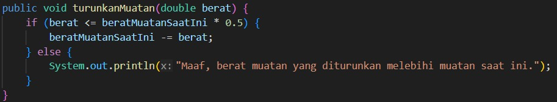
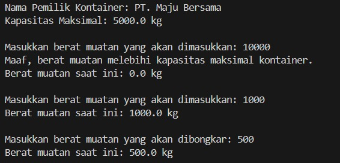
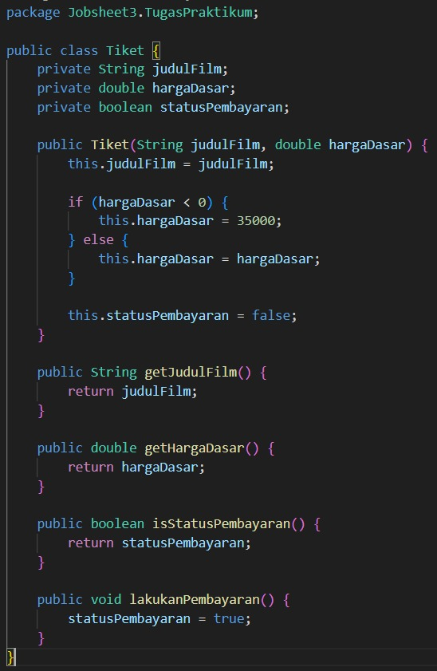

Laporan Praktikum Pemrograman Berbasis Objek

Jobsheet 3 - Enkapsulasi PBO

Identitas Mahasiswa

Nama : Syahrur Ramadhan

NIM : 254107020008

Kelas : TI-2G

Repository : https://github.com/syahrur2602/PRAKPBO_2G_26/tree/main/Jobsheet3

3. Percobaan

3.1 Percobaan 1 - Enkapsulasi

Output

3.2 Percobaan 2 - Access Modifier

Output

3.3 Pertanyaan

1. Pada class TestMobil, saat kita menambah kecepatan untuk pertama kalinya, mengapa muncul peringatan “Kecepatan tidak bisa bertambah karena Mesin Off!”?

Jawab: Karena kondisi kontakOn masih false, sehingga tambahKecepatan() tidak dapat menambah kecepatan saat mesin OFF.

2. Mengapa atribut kecepatan dan kontakOn diset private?

Jawab: Agar atribut tidak dapat diubah secara langsung dari class lain dan aksesnya dapat dikontrol melalui method yang tersedia.

3. Ubah class Motor sehingga kecepatan maksimalnya adalah 100!

Jawab: Tambahkan validasi pada tambahKecepatan() agar nilai kecepatan tidak dapat melebihi 100.

Output

3.4 Percobaan 3 - Getter dan Setter

Output

3.5 Percobaan 4 - Konstruktor dan Instansiasi

Output

3.6 Pertanyaan - Percobaan 3 dan 4

1. Apa yang dimaksud getter dan setter?

Jawab: Getter digunakan untuk mengambil nilai atribut private, sedangkan setter digunakan untuk mengubah nilai atribut private.

2. Apa kegunaan dari method getSimpanan()?

Jawab: getSimpanan() digunakan untuk mengambil nilai simpanan dari atribut private.

3. Method apa yang digunakan untuk menambah saldo?

Jawab: Method yang digunakan untuk menambah saldo adalah setor().

4. Apa yang dimaksud konstruktor?

Jawab: Konstruktor adalah method khusus yang otomatis dijalankan ketika objek dibuat untuk memberikan nilai awal pada objek.

5. Sebutkan aturan dalam membuat konstruktor!

Jawab: Nama konstruktor harus sama dengan nama class, tidak memiliki tipe return, dan tidak boleh menggunakan modifier abstract, static, final, atau synchronized.

6. Apakah boleh konstruktor bertipe private?

Jawab: Boleh, karena constructor dapat menggunakan access modifier private untuk membatasi instansiasi dari luar class.

7. Kapan menggunakan konstruktor dengan passing parameter?

Jawab: Digunakan ketika objek membutuhkan nilai awal tertentu saat dibuat.

8. Apa perbedaan inisialisasi atribut dan instansiasi atribut?

Jawab: Inisialisasi atribut adalah memberikan nilai pada atribut, sedangkan instansiasi adalah membuat objek dari sebuah class.

9. Apa perbedaan inisialisasi method dan instansiasi method?

Jawab: Method tidak diinstansiasi seperti objek, tetapi didefinisikan dalam class dan dipanggil melalui objek atau class.

4. Kesimpulan

Pada Jobsheet 3 dipelajari konsep enkapsulasi, access modifier, getter dan setter, konstruktor, serta instansiasi. Enkapsulasi digunakan untuk membatasi akses langsung terhadap atribut sehingga perubahan data dapat dikontrol melalui method yang disediakan.

5. Tugas Praktikum

5.1 Tugas 1

Menguji program EncapTest dan melihat hasil outputnya.

Output

5.2 Tugas 2

Pada program di atas, pada class EncapTest kita mengeset age dengan nilai 35, namun pada saat ditampilkan ke layar nilainya 30, jelaskan mengapa.

Jawab: Karena setter setAge() memberikan batas maksimal 30, sehingga nilai 35 otomatis dibatasi menjadi 30.

5.3 Tugas 3

Ubah program di atas agar atribut age dapat diberi nilai maksimal 30 dan minimal 18.

Jawab: Tambahkan validasi pada setAge() agar nilai kurang dari 18 menjadi 18 dan nilai lebih dari 30 menjadi 30.

Output

5.4 Tugas 4

Buatlah class Kontainer dengan atribut private, method getter, dan konstruktor sesuai kebutuhan enkapsulasi.

Jawab: Class Kontainer menggunakan atribut private dan menyediakan getter serta konstruktor. Method tambahMuatan() digunakan untuk menambah muatan dengan memperhatikan kapasitas maksimal, sedangkan turunkanMuatan() digunakan untuk mengurangi muatan.

Output

5.5 Tugas 5

Modifikasi soal kargo logistik agar nominal berat muatan yang dibongkar dalam satu kali pemanggilan turunkanMuatan() maksimal 50% dari total berat muatan saat ini.

Jawab: Tambahkan validasi pada turunkanMuatan() agar jumlah yang diturunkan tidak melebihi 50% dari muatan saat ini. Jika melebihi batas, proses diblokir dan ditampilkan pesan peringatan.

Output

5.6 Tugas 6

Modifikasi class Main TestLogistik agar input tambahMuatan dan turunkanMuatan dapat dimasukkan secara interaktif melalui terminal menggunakan Scanner.

Jawab: Gunakan java.util.Scanner untuk membaca input berat muatan dari terminal, kemudian kirim nilai tersebut ke method tambahMuatan() dan turunkanMuatan().

Output

5.7 Tugas 7

Buat class Tiket sesuai ketentuan soal dan uji menggunakan class TestBioskop.

Jawab: Class Tiket menggunakan atribut private, harga negatif otomatis menjadi Rp35.000, status pembayaran awalnya false, dan berubah menjadi true setelah lakukanPembayaran() dipanggil.

Output

